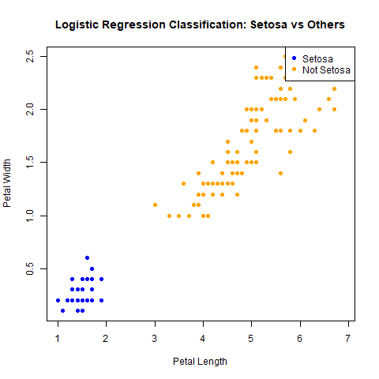
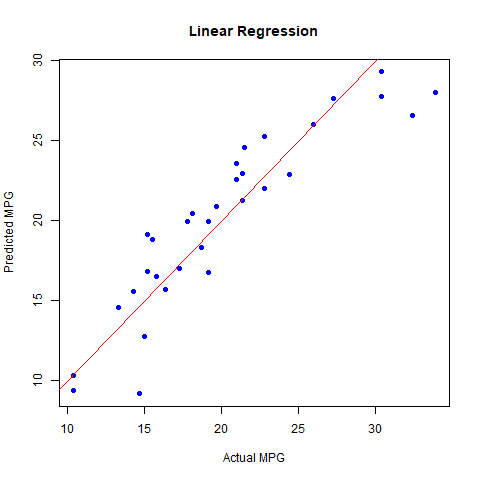

# 🌸 Logistic Regression on Iris Dataset in R

This project demonstrates **binary logistic regression** in R using the classic `iris` dataset. The model predicts whether a flower is of the **Setosa** species based on petal measurements.

> Created by [ManneUdayKiran](https://github.com/ManneUdayKiran)

---

## 📁 Project Structure

```

Regression\_Analyasis/
├── logistic\_regression\_iris.R          # Main script
├── plots/
│   └── logistic\_classification\_plot.png
└── README.md

````

---

## 🎯 Objectives

- Use logistic regression to classify Setosa vs. non-Setosa flowers.
- Visualize the classification results.
- Understand warning messages due to perfect separation in linearly separable data.

---

## 🧪 How to Run

1. Open the script in **R** or **RStudio**.
2. Set the working directory to this folder:

   setwd("C:/Users/udayk/OneDrive/Desktop/Regression_Analyasis")


3. Run the script:

   
   source("logistic_regression_iris.R")


---

## 🖼️ Output

Classification result visualization:




---

## ⚠️ Note

You may see this warning:

```
glm.fit: fitted probabilities numerically 0 or 1 occurred
```

This is expected because the Setosa class is **perfectly separable** using petal dimensions.

---

## 🔧 Future Ideas

* Apply to **versicolor vs virginica** (harder task).
* Add **ROC curve**, **accuracy metrics**, and **decision boundaries**.
* Convert to **multiclass classification** using `nnet::multinom` or `caret`.

---

## 📜 License

Free to use for educational and learning purposes.

